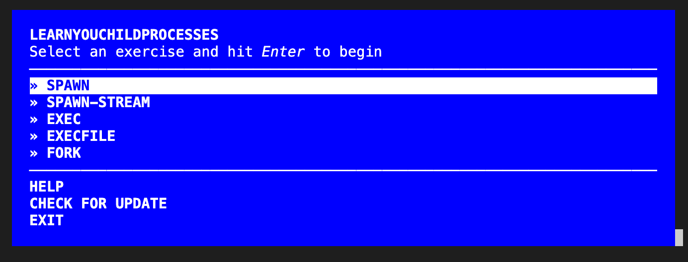

# learn you the node.js child processes

**An intro to Node.js child processes via a set of self-guided workshops.**

## What is learnyouchildprocesses?

<b><code>learnyouchildprocesses</code></b> is a Node.js package that contains a series of workshop lessons which will teach you the basics of creating and communicating with Node.js child processes. The lessons will cover the most used parts of Node's `child_process` API, namely the `spawn`, `exec`, `execFile`, and `fork` methods.

## Installing learnyouchildprocesses

1. Install [Node.js](http://nodejs.org/)
2. Run `npm install -g learnyouchildprocesses` (this installs the learnyouchildprocesses Node.js package globally).
3. Test that learnyouchildprocesses has been installed successfully by running the command `learnyouchildprocesses` in your terminal. This will start the learnyouchildprocesses application, and you should see a blue screen similar to the one in the screenshot above.

## Completing your first exercise

1. **Start up learnyouchildprocesses** in your terminal by running the command `learnyouchildprocesses` (you should see a blue screen similar to the one in the screenshot above).
2. **Start a learnyouchildprocesses exercise** by using the arrow keys to navigate, and the enter key to select a lesson. For this example, scroll to the "SPAWN" lesson and press enter. This will result in three things happening:
   1. The instructions for the "SPAWN" lesson will now be printed out to your terminal .
   2. The `learnyouchildprocesses verify` command will now be set to verify any script that you pass into it with the expected output of the lesson that you selected (in the case of the "SPAWN" lesson, the command `learnyouchildprocesses verify` will now check that the script file you pass in satisfies the expected outcomes of the "SPAWN" lesson by making sure the script prints the text "SPAWN" to stdout).
   3. The learnyouchildprocesses application will exit, allowing you to use your terminal again.
3. **Create your solution for the exercise** by creating a new script file named "program.js" and following the instructions and hints that were printed out above for the lesson. For the "SPAWN" lesson, your script "program.js" should have code in it that prints the text "SPAWN" to stdout when run with Node.js (you can test your script file with Node.js by using the command: `node program.js`).
4. **Verify that your solution to the lesson is correct** by running the command `learnyouchildprocesses verify program.js` (note: if you named your script file something other than "program.js", replace "program.js" with the correct filename). If your solution is not correct, you will see a FAIL message along with some information about why your solution didn't pass the tests. In the case of a FAIL message, rework your solution until running the verify command passes. If your solution passes the tests, you should see a "PASS" message. Congratulations! :)
5. **Move on to the next lesson** if you have verified that your solution is correct. Repeat these instructions from step 1 and select the next lesson that you would like to do (it is suggested to do the lessons in order from top to bottom).

## License

**learnyouchildprocesses** is Copyright (c) 2021 learnyouchildprocesses and licenced under the BSD 3-Clause licence. All rights not explicitly granted in the BSD license are reserved. See the included LICENSE.md file for more details.

**learnyouchildprocesses** builds on the excellent work by [@substack](https://github.com/substack) and [@maxogden](https://github.com/maxogden) who created **[stream-adventure](https://github.com/substack/stream-adventure)** which serves as the original foundation for **learnyouchildprocesses**.
